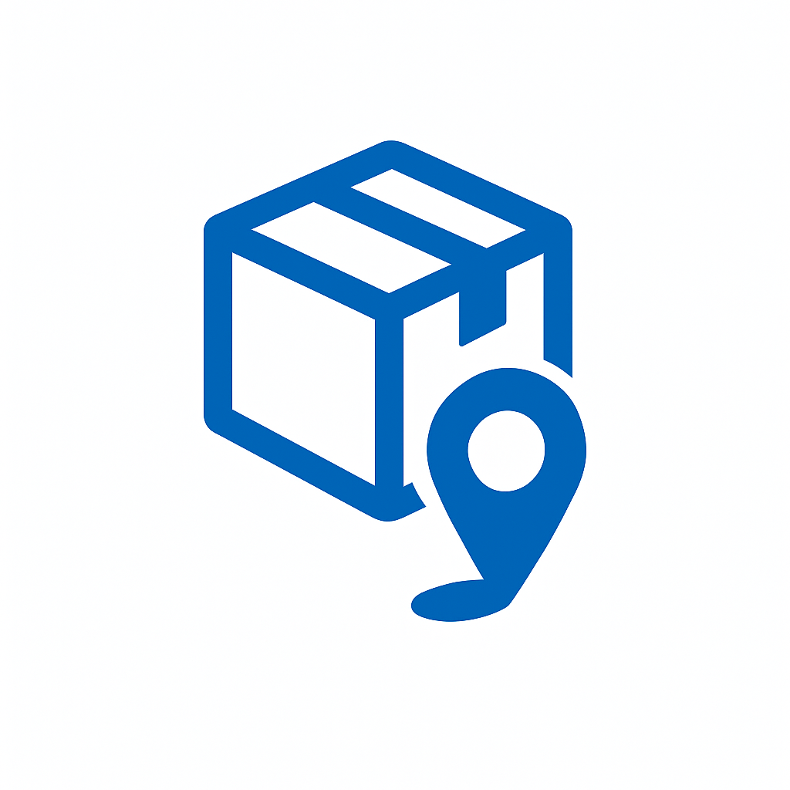

<p align="center">
  
</p>

# 🚚 GoPickup<p align="center">
  
</p>

# 🚚 GoPickup

Welcome to **GoPickup** – your modern, scalable, and secure parcel pickup and delivery platform, built with Go, MongoDB, Gin, and integrated with Twilio and SendGrid for real-time notifications!

---

## 🌟 What is GoPickup?

GoPickup is a robust backend service designed to power a modern parcel delivery ecosystem. It enables users to register, book parcel pickups, and track deliveries, while delivery partners (agents) can register, verify credentials, and manage parcel assignments efficiently.

---

## ✨ Features

- **User Registration & Login:**  
  Secure JWT-based authentication for both users and delivery partners.

- **Parcel Booking:**  
  Users can create new parcel bookings with detailed pickup & drop-off information.

- **Real-Time Notifications:**  
  - Users receive email notifications (via SendGrid) upon registration and parcel creation.
  - Delivery partners receive SMS notifications (via Twilio) upon successful registration.

- **Delivery Partner Management:**  
  - Agents register with license verification.
  - Agents can view available parcels and update parcel status (e.g., "Pending" → "Confirmed").

- **Protected Routes:**  
  Only authenticated users/agents can access sensitive endpoints.

- **Rate Limiting:**  
  Prevents abuse by limiting sign-in attempts and other routes per IP, defending against DoS attacks.

- **Payments Integration:**  
  Secure payment handling with Razorpay, including webhook support.

- **Realtime Tracking:**  
  Kafka-based GPS tracking for live parcel status.

- **Profile Image Storage:**  
  Store and manage profile images via Cloudinary.

---

## 🚀 Quickstart

### 1. **Clone the Repo**
```bash
git clone https://github.com/yourusername/go_pickup.git
cd go_pickup
```

### 2. **Set Up Environment Variables**

Create a `.env` file with:
```
PORT=your_port
MONGO_URI=your_mongodb_uri
DB_NAME=your_db_name
JWT_SECRET=your_jwt_secret
SENDGRID_API_KEY=your_sendgrid_api_key
SENDGRID_FROM_EMAIL=your_verified_sender_email
TWILIO_ACCOUNT_SID=your_twilio_sid
TWILIO_AUTH_TOKEN=your_twilio_token
TWILIO_PHONE_NUMBER=your_twilio_phone
RAZORPAY_KEY_ID=your_razorpay_key_id
RAZORPAY_KEY_SECRET=your_razorpay_key_secret
RAZORPAY_WEBHOOK_SECRET=your_razorpay_webhook_secret
```

### 3. **Build and Run with Docker**
```bash
docker build -t go_pickup .
docker run -p 8080:8080 --env-file .env go_pickup
```

---

## 📦 API Highlights

### User Endpoints
- `POST /auth/register` – Register as a user (email notification sent)
- `POST /auth/login` – Login and receive JWT
- `POST /auth/parcel` – Book a parcel (protected)
- `GET /auth/parcels` – View your parcels (protected)

### Delivery Partner Endpoints
- `POST /partner/register` – Register as a delivery partner (license verification, SMS notification)
- `POST /partner/login` – Login as agent
- `GET /partner/ParcelDetails` – View all parcels (protected)
- `POST /partner/Parcel/status` – Update parcel status (protected)

### Payment Endpoints
- `POST /payment/create-payment`
- `POST /payment/verify`

---

## 🛠️ Tech Stack

- **Go** (Golang)
- **Gin** (HTTP framework)
- **MongoDB** (NoSQL database)
- **Twilio** (SMS notifications)
- **SendGrid** (Email notifications)
- **Docker** (Containerization)
- **Kafka** (Realtime GPS tracking)
- **Cloudinary** (Profile image storage)
- **Razorpay** (Payments)

---

## 🤝 Contributing

Pull requests are welcome! For major changes, please open an issue first to discuss what you would like to change.

## 📬 Contact
Questions? Suggestions?  
Open an issue on GitHub — we're happy to help!

---
